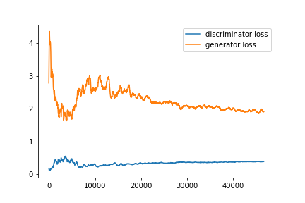
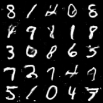
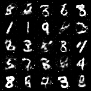

# GAN Survey

## 1/- Introduction
Dans ce projet, on va entrainer deux modèles de GAN avec la dataset MNIST. Ce projet est réalisé par 3 étudiants de l'Ecole Centrale de Nantes dans le cadre d'une évaluation d'une matière d'apprentissage statistique. On résume le travaille proposé par Goodefellow, rappelle le principe de fonctionnement des GANs et on les étudie théoriquement et reproduit leurs résultats expérimentaux. Ainsi on compare également les GANs à d'autres modèles génératives, notamment les auto-encodeurs variationnels.


## 2/- exigence
* Python (3.6)
* PyTorch deep learning framework(1.2.0)
* Torchvision (0.4.0)
* L'entrainement est effectué dans une GPU Nvidia GTX1050

## 3/- utilisation
Pour repoduire les résultas execute:


  ```
  python3 main.py --architecture dcgan
  python3 main.py --architecture dense
  ```
  
## 4/- Résultats 
### 4.1. Loss

<p float="center">
  
   
</p>


</p>

### 4.2.Samples


<p align="center">
  
  
</p>


